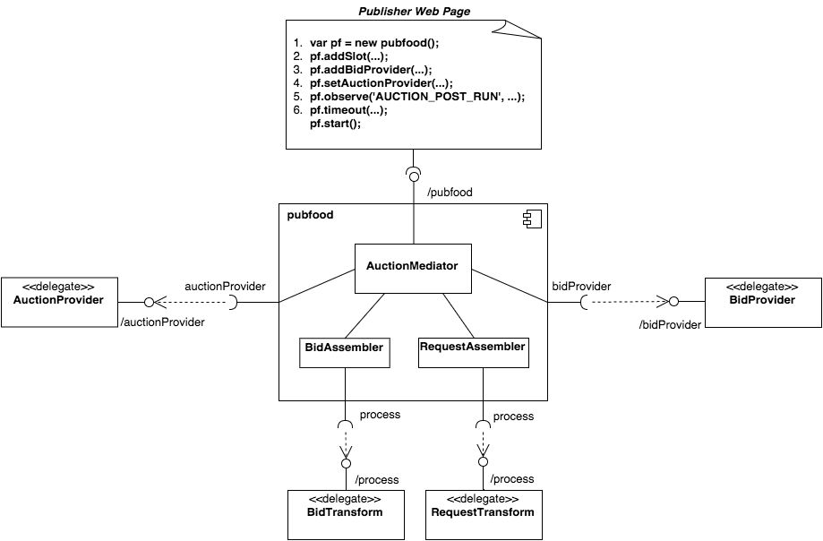

## Pubfood

[![Release][release-image]][release-url] [![Build Status][travis-image]][travis-url]


A free and open source header bidding framework built by publishers for publishers.

This repository contains the Pubfood JavaScript library. For more information
about Pubfood and header bidding please see [Pubfood.org](http://pubfood.org/) 


### Architecture Overview




### Build

```bash
npm start

# Outputs
# build/pubfood.js
# build/pubfood.min.js
```

### Test

```bash
npm test
```


### Release

1. Update [CHANGELOG.md](CHANGELOG.md)
2. Update version in [package.json](https://github.com/pubfood/pubfood/blob/master/package.json#L3)
    based on [semantic versioning](http://semver.org/)
3. Run the release script; `npm run release`
4. Confirm the release;
  - Check [Travis build](https://travis-ci.org/pubfood/pubfood)
  - Confirm the `pubfood` package is updated on npm; `npm info pubfood version`
  - Post a release announcement [here](https://pubfood.slack.com/messages/general/)


### Resources and References

- [The Header Bidding Advantage](https://www.yieldbot.com/blog/header-bidding/)
- [The Rise Of 'Header Bidding' And The End Of The Publisher Waterfall](http://adexchanger.com/publishers/the-rise-of-header-bidding-and-the-end-of-the-publisher-waterfall/)
- [Header Bidding: Step-by-Step](http://www.adopsinsider.com/ad-exchanges/diagramming-the-header-bidding-redirect-path/)


### License

Licensed under The MIT License (MIT)  
For the full copyright and license information, please view the LICENSE.txt file.


[release-url]: https://www.npmjs.com/package/pubfood
[release-image]: https://badge.fury.io/js/pubfood.svg

[travis-url]: https://travis-ci.org/pubfood/pubfood
[travis-image]: https://travis-ci.org/pubfood/pubfood.svg?branch=master
